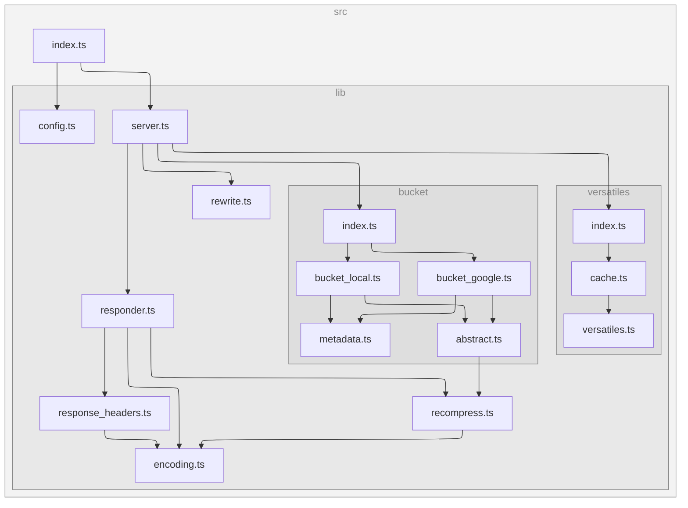

[](https://www.npmjs.com/package/@versatiles/google-cloud)
[](https://www.npmjs.com/package/@versatiles/google-cloud)
[](https://codecov.io/gh/versatiles-org/node-versatiles-google-cloud)
[](https://github.com/versatiles-org/node-versatiles-google-cloud/actions/workflows/ci.yml)
[](LICENSE)

# VersaTiles Server for Google Cloud Run

This tool solves perfectly the use cases, when you want to publish multiple map application using multiple versatiles tile sources in Google Cloud.
E.g. for data journalists, academia, ...

> [!WARNING]
> It is strongly recommended:
>
> - always use a CDN in front of this server and
> - not to modify/overwrite existing files in the bucket, as this could result in corrupted data being delivered!

## Outline:

1. Store static files (\*.html, \*.js, \*.css, …) and map tiles (\*.versatiles) in a Google Storage Bucket.
2. Run this Node.js server in Google Cloud Run using Bucket name/path as argument
3. Put a Loadbalancer (with DNS and CDN) in front of the Google Cloud Run service.

- Now you can serve the files in the Bucket publicly.
- This server will make sure that every file will be compressed optimally according to "accept-encoding" header of the browser.
- \*.versatiles files will not be served. Instead the server will provide a simple GET API to access every tile, and serve them with optimal compression. E.g. tile x=4, y=5, z=6 in file `gs://bucket/map/earth.versatiles` could be accessed via `https://public.domain.com/map/earth.versatiles?tiles/6/4/5`

## Run in Google Cloud Run

Run the following Docker Container in Google Cloud Run, e.g. by using Google Cloud Build.

```Dockerfile
FROM node:20-alpine
RUN npm install -g @versatiles/google-cloud
EXPOSE 8080
CMD npx versatiles-google-cloud -b "$BASE_URL" "$BUCKET_NAME"
```

## Path rewriting

You can define path rewriting rules to map public URLs to different paths in the bucket. Use the `-r` or `--rewrite-rule` option to specify rules in the format `/public/path /bucket/path`.

Rules can use custom pattern matching by utilizing [Custom Matching Parameters](https://github.com/pillarjs/path-to-regexp/tree/6.x?tab=readme-ov-file#custom-matching-parameters). For example, the rule `/tiles/:source.versatiles /data/:source.versatiles` will rewrite requests like `/tiles/osm.versatiles` to `/data/osm.versatiles`.

### Rewriting to VersaTiles container queries

The most common use case is mapping clean tile URLs to VersaTiles container queries. VersaTiles containers are accessed via query parameters (the part after `?`), e.g. `/data/osm.versatiles?14/8529/5975`.

The rule `/tiles/osm/:path(.+)` → `/data/osm.versatiles\?:path` uses:

- `:path(.+)` — a named capture that matches one or more characters (tile coordinates, metadata paths, etc.)
- `\?` — a literal `?` character (since `?` means "optional" in path-to-regexp, it must be escaped)

**Example rewrites:**

| Request path              | Rewritten to                        |
| ------------------------- | ----------------------------------- |
| `/tiles/osm/14/8529/5975` | `/data/osm.versatiles?14/8529/5975` |
| `/tiles/osm/meta.json`    | `/data/osm.versatiles?meta.json`    |
| `/tiles/osm/style.json`   | `/data/osm.versatiles?style.json`   |

**Shell escaping:** When passing the rule via CLI, the backslash needs to survive shell processing:

- Double quotes: `-r "/tiles/osm/:path(.+) /data/osm.versatiles\\?:path"`
- Single quotes: `-r '/tiles/osm/:path(.+) /data/osm.versatiles\?:path'`

**Config file:** In YAML, `\?` works directly in unquoted values:

```yaml
rewriteRules:
  /tiles/osm/:path(.+): /data/osm.versatiles\?:path
```

In double-quoted YAML strings, use `\\?`:

```yaml
rewriteRules:
  "/tiles/osm/:path(.+)": "/data/osm.versatiles\\?:path"
```

### Complex matching

You can create more complex matching patterns using regular expressions. For instance, the rule `/apps:any((?!.*\.[^/]+$).*)? /apps:any((?!.*\.[^/]+$).*)?/index.html` will match any path under `/apps` that does not end with a file extension and rewrite it to serve the corresponding `index.html` file.

> [!NOTE]
> When using regular expressions in rewrite rules, ensure that white-space-matches are defined using thier specific form (`\s`) since standard white spaces (` `) are used to separate source and destination (`-r "<source> <destination>"`).

## Configuration file

Instead of passing all options via command line arguments, you can use a configuration file with the `-c` or `--config` option:

```bash
versatiles-google-cloud --config ./config.yaml
```

CLI arguments always override values from the configuration file. This allows you to define defaults in the config file and override specific values as needed.

### Supported formats

Configuration files can be written in multiple formats:

- **YAML** (`.yaml`, `.yml`)
- **JSON** (`.json`)
- **JavaScript** (`.js`, `.mjs`, `.cjs`)
- **TypeScript** (`.ts`, `.mts`, `.cts`)

### Example configuration file

**YAML** (`config.yaml`):

```yaml
bucket: "my-tiles-bucket"
baseUrl: "https://tiles.example.com/"
directory: "/public/"
port: 8080
fastRecompression: false
verbose: false

rewriteRules:
  "/tiles/:name": "/geodata/:name.versatiles"
  "/tiles/osm/:path(.+)": "/data/osm.versatiles\\?:path"
  "/apps:any((?!.*\\.[^/]+$).*)?": "/apps:any/index.html"
```

**JSON** (`config.json`):

```json
{
  "bucket": "my-tiles-bucket",
  "baseUrl": "https://tiles.example.com/",
  "port": 8080,
  "rewriteRules": {
    "/tiles/:name": "/geodata/:name.versatiles"
  }
}
```

**JavaScript** (`config.mjs`):

```javascript
export default {
  bucket: "my-tiles-bucket",
  baseUrl: "https://tiles.example.com/",
  port: 8080,
};
```

### Configuration inheritance

Configuration files can extend other configurations using the `extends` property. This allows you to create a base configuration and override specific values in derived configurations.

```yaml
# base.yaml
bucket: "production-bucket"
port: 8080
verbose: false
rewriteRules:
  "/tiles/:name": "/geodata/:name.versatiles"
```

```yaml
# development.yaml
extends: ./base.yaml
bucket: "dev-bucket"
verbose: true
```

When using `extends`:

- All values from the parent config are inherited
- Values in the child config override parent values
- For `rewriteRules`, child rules are merged with parent rules (child rules take precedence)
- Multi-level inheritance is supported (grandparent → parent → child)

### Configuration options

| Option              | Type    | Description                                  |
| ------------------- | ------- | -------------------------------------------- |
| `bucket`            | string  | Name of the Google Cloud Storage bucket      |
| `baseUrl`           | string  | Public base URL                              |
| `directory`         | string  | Bucket directory prefix                      |
| `port`              | integer | Server port (default: 8080)                  |
| `fastRecompression` | boolean | Enable fast recompression mode               |
| `localDirectory`    | string  | Use local directory instead of bucket        |
| `verbose`           | boolean | Enable verbose logging                       |
| `rewriteRules`      | object  | Object mapping source paths to target paths  |
| `extends`           | string  | Path to parent configuration file to inherit |

> [!NOTE]
> When using `--config`, the bucket name can be omitted from the command line if it's specified in the config file. The bucket is only required if `localDirectory` is not set.

## Test locally

Install `@versatiles/google-cloud` globally and run:

```bash
npm install -g @versatiles/google-cloud
versatiles-google-cloud -f -l local/data/
```

Or clone and run the repo:

```bash
git clone https://github.com/versatiles-org/node-versatiles-google-cloud.git
cd node-versatiles-google-cloud
npm install
npm start -f -l local/data/
```

The arguments used:

- `-f` or `--fast-recompression` disables recompression, so it's faster if you're developing locally.
- `-l` or `--local-directory` uses a local directory instead of a Google Bucket.

Note that for security and performance reasons no file listing is implemented. If you have a file such as `local/data/app/index.html` you will need to open the correct URL in your browser to view the file: `http://localhost:8080/app/index.html`

## Options

<!--- This chapter is generated automatically --->

```console
$ versatiles-google-cloud
Usage: versatiles-google-cloud [options] [bucket-name]

Initialises a server to serve files from a specified Google Bucket to a Google
Load Balancer with CDN, handles HTTP headers and compression, and provides a
RESTful API for VersaTiles containers.
For more details, visit:
https://github.com/versatiles-org/node-versatiles-google-cloud/

Arguments:
  bucket-name                     Name of the Google Cloud Storage bucket.

Options:
  -b, --base-url <url>            Set the public base URL. Defaults to
                                  "http://localhost:<port>/".
  -c, --config <path>             Load configuration from a YAML file. CLI
                                  arguments override config file values.
  -d, --directory <prefix>        Set the bucket directory (prefix), e.g.,
                                  "/public/".
  -f, --fast-recompression        Enable faster server responses by avoiding
                                  recompression.
  -l, --local-directory <path>    Ignore bucket and use a local directory
                                  instead. Useful for local development and
                                  testing.
  -p, --port <port>               Set the server port. Default: 8080
  -r, --rewrite-rule <path path>  Set a rewrite rule using path-to-regexp
                                  patterns. Both sides must start with "/".
                                  Multiple rules can be set. Use "\?" for a
                                  literal "?" since "?" means "optional" in
                                  path-to-regexp. E.g. "/tiles/:path(.+)
                                  /data/map.versatiles\?:path" rewrites
                                  "/tiles/5/17/11" to
                                  "/data/map.versatiles?5/17/11". (default: [])
  -v, --verbose                   Enable verbose mode for detailed operational
                                  logs.
  -h, --help                      display help for command
```

## Dependency Graph

<!--- This chapter is generated automatically --->



## License

[Unlicense](./LICENSE.md)
