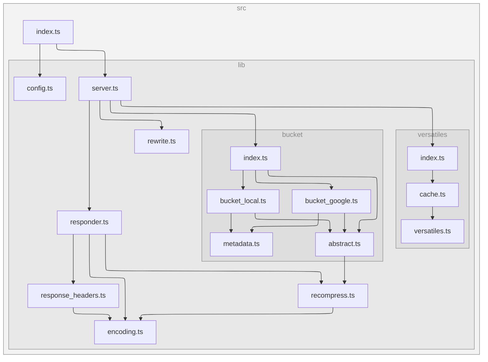

[](https://www.npmjs.com/package/@versatiles/google-cloud)
[](https://www.npmjs.com/package/@versatiles/google-cloud)
[](https://codecov.io/gh/versatiles-org/node-versatiles-google-cloud)
[](https://github.com/versatiles-org/node-versatiles-google-cloud/actions/workflows/ci.yml)
[](LICENSE)

# VersaTiles Server for Google Cloud Run

This tool solves perfectly the use cases, when you want to publish multiple map application using multiple versatiles tile sources in Google Cloud.
E.g. for data journalists, academia, ...

> [!WARNING]
> It is strongly recommended:
>
> - always use a CDN in front of this server and
> - not to modify/overwrite existing files in the bucket, as this could result in corrupted data being delivered!

## Outline:

1. Store static files (\*.html, \*.js, \*.css, …) and map tiles (\*.versatiles) in a Google Storage Bucket.
2. Run this Node.js server in Google Cloud Run using Bucket name/path as argument
3. Put a Loadbalancer (with DNS and CDN) in front of the Google Cloud Run service.

- Now you can serve the files in the Bucket publicly.
- This server will make sure that every file will be compressed optimally according to "accept-encoding" header of the browser.
- \*.versatiles files will not be served. Instead the server will provide a simple GET API to access every tile, and serve them with optimal compression. E.g. tile x=4, y=5, z=6 in file `gs://bucket/map/earth.versatiles` could be accessed via `https://public.domain.com/map/earth.versatiles?tiles/6/4/5`

## Run in Google Cloud Run

Run the following Docker Container in Google Cloud Run, e.g. by using Google Cloud Build.

```Dockerfile
FROM node:20-alpine
RUN npm install -g @versatiles/google-cloud
EXPOSE 8080
CMD npx versatiles-google-cloud -b "$BASE_URL" "$BUCKET_NAME"
```

## Path rewriting

You can define path rewriting rules to map public URLs to different paths in the bucket. Use the `-r` or `--rewrite-rule` option to specify rules in the format `/public/path /bucket/path`, or the `rewriteRules` key in a [configuration file](#configuration-file).

For example, the rule `/tiles/:source.versatiles /data/:source.versatiles` rewrites requests like `/tiles/osm.versatiles` to `/data/osm.versatiles`.

### Pattern syntax

Both sides of a rule must start with `/`. The left side is a pattern matched against the request path; the right side is a template that may reference any parameter captured on the left.

| Token       | Matches                                   | Example                                                         |
| ----------- | ----------------------------------------- | --------------------------------------------------------------- |
| literal     | itself                                    | `/tiles` matches `/tiles`                                       |
| `:name`     | exactly one path segment                  | `/tiles/:name` matches `/tiles/osm`, but not `/tiles/a/b`       |
| `:name?`    | an optional single segment                | `/api/:version?/users` matches `/api/users` and `/api/v1/users` |
| `:name+`    | one or more segments                      | `/files/:path+` matches `/files/a` and `/files/a/b/c`           |
| `:name(re)` | text matching the regular expression `re` | `/tiles/:z(\d+)` matches `/tiles/14`, but not `/tiles/osm`      |
| `\x`        | the literal character `x`                 | `\?` matches a literal `?`                                      |

A parameter may be followed directly by literal text, which is matched as a suffix: `/tiles/:source.versatiles` captures `osm` from `/tiles/osm.versatiles`.

On the right side, `:name` is replaced by the captured value.

> [!IMPORTANT]
> A parameter written with a modifier or a regular expression on the left must be written **identically on the right**, including the `?` or `+` and the expression itself. Writing `:name` on the right for a pattern declared as `:name?` on the left makes the rule fail at request time whenever the parameter is absent.

### How rules are applied

- Rules are tried in the order they are defined, and **the first matching rule wins**. Later rules are not consulted.
- A pattern must match the **entire** request path, not a prefix.
- If no rule matches, the request path is used unchanged.
- Matching **ignores case** and tolerates a single trailing slash, so `/tiles` also matches `/Tiles` and `/tiles/`.
- Percent-encoded characters are passed through unchanged; the path is decoded after rewriting.

### Escaping special characters

The characters `? + * ( ) :` and `\` are part of the pattern syntax. To match one literally, prefix it with a backslash — most commonly `\?`, since VersaTiles container queries contain a literal `?`.

Whitespace separates the two sides of a `--rewrite-rule` argument, so a pattern that needs to match a space must use `\s` rather than a literal space.

> [!NOTE]
> Regular expressions in `:name(re)` are matched against paths supplied by clients. Keep them simple and avoid nested quantifiers such as `(a+)+`, which can be exploited to consume large amounts of CPU.

> [!NOTE]
> The syntax described above is the stable contract of this package. It is currently implemented on top of `path-to-regexp`, but only the documented subset is supported — patterns relying on undocumented behaviour of that library may break in a future release.

### Rewriting to VersaTiles container queries

The most common use case is mapping clean tile URLs to VersaTiles container queries. VersaTiles containers are accessed via query parameters (the part after `?`), e.g. `/data/osm.versatiles?14/8529/5975`.

The rule `/tiles/osm/:path(.+)` → `/data/osm.versatiles\?:path` uses:

- `:path(.+)` — a named capture that matches one or more characters (tile coordinates, metadata paths, etc.)
- `\?` — a literal `?` character (since a bare `?` marks a parameter as optional, it must be escaped)

**Example rewrites:**

| Request path              | Rewritten to                        |
| ------------------------- | ----------------------------------- |
| `/tiles/osm/14/8529/5975` | `/data/osm.versatiles?14/8529/5975` |
| `/tiles/osm/meta.json`    | `/data/osm.versatiles?meta.json`    |
| `/tiles/osm/style.json`   | `/data/osm.versatiles?style.json`   |

**Shell escaping:** When passing the rule via CLI, the backslash needs to survive shell processing:

- Double quotes: `-r "/tiles/osm/:path(.+) /data/osm.versatiles\\?:path"`
- Single quotes: `-r '/tiles/osm/:path(.+) /data/osm.versatiles\?:path'`

**Config file:** In YAML, `\?` works directly in unquoted values:

```yaml
rewriteRules:
  /tiles/osm/:path(.+): /data/osm.versatiles\?:path
```

In double-quoted YAML strings, use `\\?`:

```yaml
rewriteRules:
  "/tiles/osm/:path(.+)": "/data/osm.versatiles\\?:path"
```

### Serving `index.html` for extensionless paths

Single-page applications usually need every route that is not a file to fall back to `index.html`. The rule `/apps:any((?!.*\.[^/]+$).*)? /apps:any((?!.*\.[^/]+$).*)?/index.html` matches any path under `/apps` that does not end with a file extension and rewrites it to the corresponding `index.html`:

| Request path             | Rewritten to                                |
| ------------------------ | ------------------------------------------- |
| `/apps/editor`           | `/apps/editor/index.html`                   |
| `/apps/editor/settings`  | `/apps/editor/settings/index.html`          |
| `/apps/editor/bundle.js` | <em>(unchanged — has a file extension)</em> |

> [!WARNING]
> There is no separator between the `/apps` literal and the parameter, so this rule also matches sibling paths that merely start with the same characters — `/apps-admin` and `/appsX` are rewritten too. To match only below `/apps`, put a `/` before the parameter on both sides:
>
> ```
> /apps/:any((?!.*\.[^/]+$).*)? /apps/:any((?!.*\.[^/]+$).*)?/index.html
> ```
>
> This still rewrites `/apps` itself to `/apps/index.html`, but leaves `/apps-admin` and `/appsX` untouched.

## Configuration file

Instead of passing all options via command line arguments, you can use a configuration file with the `-c` or `--config` option:

```bash
versatiles-google-cloud --config ./config.yaml
```

CLI arguments always override values from the configuration file. This allows you to define defaults in the config file and override specific values as needed.

### Supported formats

Configuration files can be written in multiple formats:

- **YAML** (`.yaml`, `.yml`)
- **JSON** (`.json`)
- **JavaScript** (`.js`, `.mjs`, `.cjs`)
- **TypeScript** (`.ts`, `.mts`, `.cts`)

### Example configuration file

**YAML** (`config.yaml`):

```yaml
bucket: "my-tiles-bucket"
baseUrl: "https://tiles.example.com/"
directory: "/public/"
port: 8080
fastRecompression: false
verbose: false

rewriteRules:
  "/tiles/:name": "/geodata/:name.versatiles"
  "/tiles/osm/:path(.+)": "/data/osm.versatiles\\?:path"
  "/apps/:any((?!.*\\.[^/]+$).*)?": "/apps/:any((?!.*\\.[^/]+$).*)?/index.html"
```

**JSON** (`config.json`):

```json
{
  "bucket": "my-tiles-bucket",
  "baseUrl": "https://tiles.example.com/",
  "port": 8080,
  "rewriteRules": {
    "/tiles/:name": "/geodata/:name.versatiles"
  }
}
```

**JavaScript** (`config.mjs`):

```javascript
export default {
  bucket: "my-tiles-bucket",
  baseUrl: "https://tiles.example.com/",
  port: 8080,
};
```

### Configuration inheritance

Configuration files can extend other configurations using the `extends` property. This allows you to create a base configuration and override specific values in derived configurations.

```yaml
# base.yaml
bucket: "production-bucket"
port: 8080
verbose: false
rewriteRules:
  "/tiles/:name": "/geodata/:name.versatiles"
```

```yaml
# development.yaml
extends: ./base.yaml
bucket: "dev-bucket"
verbose: true
```

When using `extends`:

- All values from the parent config are inherited
- Values in the child config override parent values
- For `rewriteRules`, child rules are merged with parent rules (child rules take precedence)
- Multi-level inheritance is supported (grandparent → parent → child)

### Configuration options

| Option              | Type    | Description                                  |
| ------------------- | ------- | -------------------------------------------- |
| `bucket`            | string  | Name of the Google Cloud Storage bucket      |
| `baseUrl`           | string  | Public base URL                              |
| `directory`         | string  | Bucket directory prefix                      |
| `port`              | integer | Server port (default: 8080)                  |
| `fastRecompression` | boolean | Enable fast recompression mode               |
| `localDirectory`    | string  | Use local directory instead of bucket        |
| `verbose`           | boolean | Enable verbose logging                       |
| `rewriteRules`      | object  | Object mapping source paths to target paths  |
| `extends`           | string  | Path to parent configuration file to inherit |

> [!NOTE]
> When using `--config`, the bucket name can be omitted from the command line if it's specified in the config file. The bucket is only required if `localDirectory` is not set.

## Test locally

Install `@versatiles/google-cloud` globally and run:

```bash
npm install -g @versatiles/google-cloud
versatiles-google-cloud -f -l local/data/
```

Or clone and run the repo:

```bash
git clone https://github.com/versatiles-org/node-versatiles-google-cloud.git
cd node-versatiles-google-cloud
npm install
npm start -f -l local/data/
```

The arguments used:

- `-f` or `--fast-recompression` disables recompression, so it's faster if you're developing locally.
- `-l` or `--local-directory` uses a local directory instead of a Google Bucket.

Note that for security and performance reasons no file listing is implemented. If you have a file such as `local/data/app/index.html` you will need to open the correct URL in your browser to view the file: `http://localhost:8080/app/index.html`

## Options

<!--- This chapter is generated automatically --->

```console
$ versatiles-google-cloud
Usage: versatiles-google-cloud [options] [bucket-name]

Initialises a server to serve files from a specified Google Bucket to a Google
Load Balancer with CDN, handles HTTP headers and compression, and provides a
RESTful API for VersaTiles containers.
For more details, visit:
https://github.com/versatiles-org/node-versatiles-google-cloud/

Arguments:
  bucket-name                     Name of the Google Cloud Storage bucket.

Options:
  -b, --base-url <url>            Set the public base URL. Defaults to
                                  "http://localhost:<port>/".
  -c, --config <path>             Load configuration from a YAML file. CLI
                                  arguments override config file values.
  -d, --directory <prefix>        Set the bucket directory (prefix), e.g.,
                                  "/public/".
  -f, --fast-recompression        Enable faster server responses by avoiding
                                  recompression.
  -l, --local-directory <path>    Ignore bucket and use a local directory
                                  instead. Useful for local development and
                                  testing.
  -p, --port <port>               Set the server port. Default: 8080
  -r, --rewrite-rule <path path>  Set a rewrite rule mapping a request path to a
                                  bucket path. Both sides must start with "/".
                                  Multiple rules can be set; the first match
                                  wins. Use ":name" to capture a path segment,
                                  ":name(regex)" to constrain it, and "\?" for a
                                  literal "?". E.g. "/tiles/:path(.+)
                                  /data/map.versatiles\?:path" rewrites
                                  "/tiles/5/17/11" to
                                  "/data/map.versatiles?5/17/11". See the README
                                  for the full pattern syntax. (default: [])
  -v, --verbose                   Enable verbose mode for detailed operational
                                  logs.
  -h, --help                      display help for command
```

## Dependency Graph

<!--- This chapter is generated automatically --->


```mermaid
---
config:
  layout: elk
---
flowchart TB

subgraph 0["src"]
1["index.ts"]
subgraph 2["lib"]
3["config.ts"]
4["server.ts"]
subgraph 5["bucket"]
6["index.ts"]
7["abstract.ts"]
A["bucket_google.ts"]
B["metadata.ts"]
C["bucket_local.ts"]
end
8["recompress.ts"]
9["encoding.ts"]
D["responder.ts"]
E["response_headers.ts"]
F["rewrite.ts"]
subgraph G["versatiles"]
H["index.ts"]
I["cache.ts"]
J["versatiles.ts"]
end
end
end
1-->3
1-->4
4-->6
4-->D
4-->F
4-->H
6-->7
6-->A
6-->C
7-->8
8-->9
A-->7
A-->B
C-->7
C-->B
D-->9
D-->8
D-->E
E-->9
H-->I
I-->J

class 0,2,5,G subgraphs;
classDef subgraphs fill-opacity:0.1, fill:#888, color:#888, stroke:#888;
```

## License

[Unlicense](./LICENSE.md)
