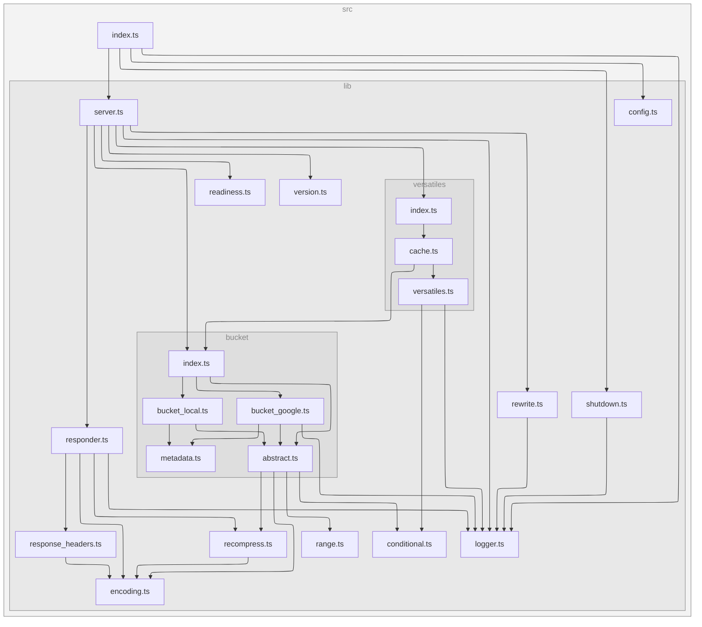

[](https://www.npmjs.com/package/@versatiles/google-cloud)
[](https://www.npmjs.com/package/@versatiles/google-cloud)
[](https://codecov.io/gh/versatiles-org/node-versatiles-google-cloud)
[](https://github.com/versatiles-org/node-versatiles-google-cloud/actions/workflows/ci.yml)
[](LICENSE)

# VersaTiles Server for Google Cloud Run

This tool solves perfectly the use cases, when you want to publish multiple map application using multiple versatiles tile sources in Google Cloud.
E.g. for data journalists, academia, ...

> [!WARNING]
> It is strongly recommended:
>
> - always use a CDN in front of this server and
> - to publish an updated tile set under a new name rather than overwriting one in place.
>
> Overwriting a container no longer serves corrupt tiles — see [Container caching](#container-caching) — but CDN and browser caches keep serving the previous tiles until they expire, which is a week by default. Clients can therefore see a mix of old and new tiles for some time after an in-place replacement.

## Outline:

1. Store static files (\*.html, \*.js, \*.css, …) and map tiles (\*.versatiles) in a Google Storage Bucket.
2. Run this Node.js server in Google Cloud Run using Bucket name/path as argument
3. Put a Loadbalancer (with DNS and CDN) in front of the Google Cloud Run service.

- Now you can serve the files in the Bucket publicly.
- This server will make sure that every file will be compressed optimally according to "accept-encoding" header of the browser.
- \*.versatiles files will not be served. Instead the server will provide a simple GET API to access every tile, and serve them with optimal compression. E.g. tile x=4, y=5, z=6 in file `gs://bucket/map/earth.versatiles` could be accessed via `https://public.domain.com/map/earth.versatiles?tiles/6/4/5`

## Run in Google Cloud Run

Run the following Docker Container in Google Cloud Run, e.g. by using Google Cloud Build.

```Dockerfile
FROM node:24-alpine

RUN npm install -g "@versatiles/google-cloud"

USER node

EXPOSE 8080

CMD npx versatiles-google-cloud -b "$BASE_URL" "$BUCKET_NAME"
```

## Path rewriting

You can define path rewriting rules to map public URLs to different paths in the bucket. Use the `-r` or `--rewrite-rule` option to specify rules in the format `/public/path /bucket/path`, or the `rewriteRules` key in a [configuration file](#configuration-file).

For example, the rule `/tiles/:source.versatiles /data/:source.versatiles` rewrites requests like `/tiles/osm.versatiles` to `/data/osm.versatiles`.

### Pattern syntax

Both sides of a rule must start with `/`. The left side is a pattern matched against the request path; the right side is a template that may reference any parameter captured on the left.

| Token       | Matches                                   | Example                                                         |
| ----------- | ----------------------------------------- | --------------------------------------------------------------- |
| literal     | itself                                    | `/tiles` matches `/tiles`                                       |
| `:name`     | exactly one path segment                  | `/tiles/:name` matches `/tiles/osm`, but not `/tiles/a/b`       |
| `:name?`    | an optional single segment                | `/api/:version?/users` matches `/api/users` and `/api/v1/users` |
| `:name+`    | one or more segments                      | `/files/:path+` matches `/files/a` and `/files/a/b/c`           |
| `:name(re)` | text matching the regular expression `re` | `/tiles/:z(\d+)` matches `/tiles/14`, but not `/tiles/osm`      |
| `\x`        | the literal character `x`                 | `\?` matches a literal `?`                                      |

A parameter may be followed directly by literal text, which is matched as a suffix: `/tiles/:source.versatiles` captures `osm` from `/tiles/osm.versatiles`.

On the right side, `:name` is replaced by the captured value.

> [!IMPORTANT]
> A parameter written with a modifier or a regular expression on the left must be written **identically on the right**, including the `?` or `+` and the expression itself. Writing `:name` on the right for a pattern declared as `:name?` on the left makes the rule fail at request time whenever the parameter is absent.

### How rules are applied

- Rules are tried in the order they are defined, and **the first matching rule wins**. Later rules are not consulted.
- A pattern must match the **entire** request path, not a prefix.
- If no rule matches, the request path is used unchanged.
- Matching **ignores case** and tolerates a single trailing slash, so `/tiles` also matches `/Tiles` and `/tiles/`.
- Percent-encoded characters are passed through unchanged; the path is decoded after rewriting.

### Escaping special characters

The characters `? + * ( ) :` and `\` are part of the pattern syntax. To match one literally, prefix it with a backslash — most commonly `\?`, since VersaTiles container queries contain a literal `?`.

Whitespace separates the two sides of a `--rewrite-rule` argument, so a pattern that needs to match a space must use `\s` rather than a literal space.

> [!NOTE]
> Regular expressions in `:name(re)` are matched against paths supplied by clients. Keep them simple and avoid nested quantifiers such as `(a+)+`, which can be exploited to consume large amounts of CPU.

> [!NOTE]
> The syntax described above is the stable contract of this package. It is currently implemented on top of `path-to-regexp`, but only the documented subset is supported — patterns relying on undocumented behaviour of that library may break in a future release.

### Rewriting to VersaTiles container queries

The most common use case is mapping clean tile URLs to VersaTiles container queries. VersaTiles containers are accessed via query parameters (the part after `?`), e.g. `/data/osm.versatiles?14/8529/5975`.

The rule `/tiles/osm/:path(.+)` → `/data/osm.versatiles\?:path` uses:

- `:path(.+)` — a named capture that matches one or more characters (tile coordinates, metadata paths, etc.)
- `\?` — a literal `?` character (since a bare `?` marks a parameter as optional, it must be escaped)

**Example rewrites:**

| Request path              | Rewritten to                        |
| ------------------------- | ----------------------------------- |
| `/tiles/osm/14/8529/5975` | `/data/osm.versatiles?14/8529/5975` |
| `/tiles/osm/meta.json`    | `/data/osm.versatiles?meta.json`    |
| `/tiles/osm/style.json`   | `/data/osm.versatiles?style.json`   |

**Shell escaping:** When passing the rule via CLI, the backslash needs to survive shell processing:

- Double quotes: `-r "/tiles/osm/:path(.+) /data/osm.versatiles\\?:path"`
- Single quotes: `-r '/tiles/osm/:path(.+) /data/osm.versatiles\?:path'`

**Config file:** In YAML, `\?` works directly in unquoted values:

```yaml
rewriteRules:
  /tiles/osm/:path(.+): /data/osm.versatiles\?:path
```

In double-quoted YAML strings, use `\\?`:

```yaml
rewriteRules:
  "/tiles/osm/:path(.+)": "/data/osm.versatiles\\?:path"
```

### Serving `index.html` for extensionless paths

Single-page applications usually need every route that is not a file to fall back to `index.html`. The rule `/apps:any((?!.*\.[^/]+$).*)? /apps:any((?!.*\.[^/]+$).*)?/index.html` matches any path under `/apps` that does not end with a file extension and rewrites it to the corresponding `index.html`:

| Request path             | Rewritten to                                |
| ------------------------ | ------------------------------------------- |
| `/apps/editor`           | `/apps/editor/index.html`                   |
| `/apps/editor/settings`  | `/apps/editor/settings/index.html`          |
| `/apps/editor/bundle.js` | <em>(unchanged — has a file extension)</em> |

> [!WARNING]
> There is no separator between the `/apps` literal and the parameter, so this rule also matches sibling paths that merely start with the same characters — `/apps-admin` and `/appsX` are rewritten too. To match only below `/apps`, put a `/` before the parameter on both sides:
>
> ```
> /apps/:any((?!.*\.[^/]+$).*)? /apps/:any((?!.*\.[^/]+$).*)?/index.html
> ```
>
> This still rewrites `/apps` itself to `/apps/index.html`, but leaves `/apps-admin` and `/appsX` untouched.

## Health endpoints

Two endpoints are provided for load balancers and orchestrators. They answer different questions and should be wired to different probes.

| Endpoint       | Question                              | Healthy      | Unhealthy    |
| -------------- | ------------------------------------- | ------------ | ------------ |
| `/healthcheck` | Is the process alive?                 | `200` `ok`   | no response  |
| `/readiness`   | Should this instance receive traffic? | `200` + JSON | `503` + JSON |

`/healthcheck` checks nothing beyond the process itself and always answers `200 ok` as `text/plain`. Use it for liveness probes — the kind that **restart** an instance when they fail.

`/readiness` reports whether the bucket is reachable, which also catches credentials that expire after startup. Use it for readiness probes and load balancer health checks — the kind that **remove** an instance from rotation. It answers with JSON:

```json
{ "ready": true, "version": "2.0.0" }
```

Probes should key off the status code; `ready` merely restates it. `version` is the running version of this package, reported on failure as well, so a bad rollout can be identified from the probe alone:

```bash
curl -s https://your-service/readiness | jq -r .version
```

> [!NOTE]
> This is the only place the version is exposed. The `server` response header is deliberately versionless, since advertising a version on every response lets clients match it against known advisories. Bear in mind that `/readiness` is unauthenticated: if that is a concern, restrict it at your load balancer.

> [!IMPORTANT]
> Do not point a liveness probe at `/readiness`. A Cloud Storage problem affects every instance at once, so restarting on that signal turns a degraded dependency into a dead service. Taking instances out of rotation is recoverable; a restart loop is not.

The bucket is not contacted on every request: a successful check is cached for 30 seconds, and a failed one for 1 second so an instance returns to service promptly once the bucket is reachable again. Probes arriving together share a single check. The reason for a failure is written to the log rather than returned, since it can name buckets and credentials.

> [!NOTE]
> Both paths are handled by the server itself, so bucket objects named `healthcheck` or `readiness` at the root are not reachable.

## Range requests

Static files are served with `Accept-Ranges: bytes`, so clients can request part of a file instead of the whole thing — used for resumable downloads, seeking in audio and video, and PDF viewers that fetch a page at a time.

A request carrying a `Range` header is answered with `206 Partial Content` and a `Content-Range` header:

```console
$ curl -r 0-9 -i https://public.domain.com/video.mp4
HTTP/1.1 206 Partial Content
content-length: 10
content-type: video/mp4
accept-ranges: bytes
content-range: bytes 0-9/5242880
```

Three forms are understood, all relative to the stored file:

| Header        | Meaning                      |
| ------------- | ---------------------------- |
| `bytes=0-999` | the first 1000 bytes         |
| `bytes=1000-` | everything from byte 1000 on |
| `bytes=-500`  | the last 500 bytes           |

A range whose end runs past the file is not an error — it is clamped to the last byte. A range whose start lies beyond the end of the file cannot be satisfied:

```console
$ curl -H 'Range: bytes=99999999-' -i https://public.domain.com/video.mp4
HTTP/1.1 416 Range Not Satisfiable
content-length: 0
accept-ranges: bytes
content-range: bytes */5242880
```

### Limitations

Both are deliberate, and both are permitted responses to a `Range` request:

- **One range per request.** A header naming several ranges (`bytes=0-9,20-29`) is ignored and the full file is returned, rather than answered with a `multipart/byteranges` body. Malformed headers and units other than `bytes` are ignored the same way.
- **Range responses are never compressed.** Byte offsets refer to the file as stored, so a compressed body would not match the offsets in `Content-Range`. A request with both `Range` and `Accept-Encoding: gzip` therefore receives the raw bytes. Requests without a `Range` header are still compressed according to `accept-encoding` as usual.

> [!NOTE]
> Ranges apply to static files only. VersaTiles containers are addressed through query parameters (`?{z}/{x}/{y}`, `?meta.json`, …), which already return exactly one tile or document, so those responses do not advertise `Accept-Ranges`.

## Pre-compressed objects

An object may be stored already compressed, with its `Content-Encoding` set in the bucket. Such objects are read exactly as stored, never decompressed on the way out of Cloud Storage — the size recorded for an object counts its stored bytes, so anything else would send a `Content-Length` describing a body the client does not receive, and byte ranges would name offsets into a representation that no longer exists.

From there the usual negotiation applies: a client accepting `gzip` gets the stored bytes untouched, one accepting `br` gets them transcoded, and one accepting neither gets them decompressed.

`gzip` and `br` are the encodings this server understands. An object stored under any other encoding is forwarded exactly as it is, still labelled with its `Content-Encoding`, rather than being negotiated — there is nothing to negotiate with bytes we cannot decode.

## Compression effort

Responses are compressed as well as the client's `Accept-Encoding` allows, but not at any price. Brotli's best setting is slow enough that a single request for a large object can occupy a core for seconds, and nothing in a request says how large the object behind it is — so above **1 MiB** the next setting down is used instead.

On 8 MiB of GeoJSON-like text, the two settings compare as:

| Setting                     | Time   | Result   |
| --------------------------- | ------ | -------- |
| brotli quality 11 (≤ 1 MiB) | 2.25 s | 0.28 MiB |
| brotli quality 5 (> 1 MiB)  | 0.03 s | 0.36 MiB |

75× the CPU for a quarter off the bytes is worth it on a tile, where neither figure is noticeable, and not worth it on anything large.

A body whose length is not known in advance — a stream the bucket did not declare a size for — counts as large, since that is exactly the case that may turn out to be enormous.

`--fast-recompression` is separate and stronger: it disables recompression altogether wherever the stored encoding is already acceptable to the client, and uses the fastest settings when it is not.

## Conditional requests

Every response carries an `ETag`, so a client or CDN that already holds a copy can revalidate instead of downloading it again:

```console
$ curl -H 'If-None-Match: "4689…"' -i https://public.domain.com/map.versatiles?14/8529/5975
HTTP/1.1 304 Not Modified
cache-control: max-age=86400
etag: "4689…"
```

This covers static files and every container response — tiles, `meta.json`, `tiles.json`, `style.json` and `preview`. Weak validators (`W/"…"`), comma-separated lists and `*` are all accepted, as RFC 9110 prescribes for this header.

A container's validators are derived from the container's revision plus what was requested, so they change automatically when the container is replaced and never need to be tracked separately. For tiles this is known **before** the tile is read, so a revalidated tile costs no bucket read at all.

Tiles a container does not contain are included. A sparse container has far more absent tiles than present ones, so the `204 No Content` answering each of them carries a validator and `cache-control` like any other tile, and a CDN caches and revalidates it the same way:

```console
$ curl -i https://public.domain.com/map.versatiles?14/0/0
HTTP/1.1 204 No Content
cache-control: max-age=86400
etag: "4689…"
vary: accept-encoding
```

`If-None-Match` is evaluated before `Range`: a client whose copy is still current gets a `304` rather than a `206`.

## Container caching

Serving a tile requires the container's header and tile index, so re-reading them on every request would add several round trips to the bucket. Instead each container is parsed once and kept in memory — up to 100 of them, least-recently-used first — and only the tile bytes themselves are fetched per request.

### Replacing a container is safe

Cached index offsets describe one specific revision of a file. Resolving them against a container that has since been overwritten would return unrelated bytes, and the result would look like a perfectly valid tile.

That cannot happen: **every read names the revision its index came from**. Cloud Storage serves that exact generation or refuses the read; for a local directory the file's identity is re-checked before each read. If the container has been replaced, the read fails, the stale index is discarded, and the request is retried against the current revision. The client sees a correct tile, not a corrupt one, and no error.

### How quickly a replacement is noticed

| Bucket configuration                    | Detected                                                                                                            |
| --------------------------------------- | ------------------------------------------------------------------------------------------------------------------- |
| Object versioning **off** (the default) | Immediately — the previous generation is gone, so the next read fails and the index is reread                       |
| Object versioning **on**                | Within 30 seconds — the previous generation still exists, so reads keep succeeding until a background check notices |

The background check runs at most once every 30 seconds per container and never blocks a response, because a cached container is safe to serve regardless. With versioning enabled, a replacement can therefore serve the **previous** container for up to that interval — stale, but never inconsistent.

> [!NOTE]
> This is not the dominant source of staleness. Tile responses are sent with `cache-control: max-age=86400`, so a CDN in front of this server keeps serving the old tiles for up to a day regardless of what the origin does — and static files are sent with `max-age=604800`, a week, unless the object overrides it. Publishing under a new name avoids the problem entirely.
>
> Clients cannot shorten this: `Cache-Control: no-cache` on a request is ignored, both here and typically at the CDN. Letting an unauthenticated caller force a cache bypass would turn each request into a metadata lookup plus a full index read against the bucket.

## Configuration file

Instead of passing all options via command line arguments, you can use a configuration file with the `-c` or `--config` option:

```bash
versatiles-google-cloud --config ./config.yaml
```

CLI arguments always override values from the configuration file. This allows you to define defaults in the config file and override specific values as needed.

### Supported formats

Configuration files can be written in multiple formats:

- **YAML** (`.yaml`, `.yml`)
- **JSON** (`.json`)
- **JavaScript** (`.js`, `.mjs`, `.cjs`)
- **TypeScript** (`.ts`, `.mts`, `.cts`)

### Example configuration file

**YAML** (`config.yaml`):

```yaml
bucket: "my-tiles-bucket"
baseUrl: "https://tiles.example.com/"
directory: "/public/"
port: 8080
fastRecompression: false
verbose: false

rewriteRules:
  "/tiles/:name": "/geodata/:name.versatiles"
  "/tiles/osm/:path(.+)": "/data/osm.versatiles\\?:path"
  "/apps/:any((?!.*\\.[^/]+$).*)?": "/apps/:any((?!.*\\.[^/]+$).*)?/index.html"
```

**JSON** (`config.json`):

```json
{
  "bucket": "my-tiles-bucket",
  "baseUrl": "https://tiles.example.com/",
  "port": 8080,
  "rewriteRules": {
    "/tiles/:name": "/geodata/:name.versatiles"
  }
}
```

**JavaScript** (`config.mjs`):

```javascript
export default {
  bucket: "my-tiles-bucket",
  baseUrl: "https://tiles.example.com/",
  port: 8080,
};
```

### Configuration inheritance

Configuration files can extend other configurations using the `extends` property. This allows you to create a base configuration and override specific values in derived configurations.

```yaml
# base.yaml
bucket: "production-bucket"
port: 8080
verbose: false
rewriteRules:
  "/tiles/:name": "/geodata/:name.versatiles"
```

```yaml
# development.yaml
extends: ./base.yaml
bucket: "dev-bucket"
verbose: true
```

When using `extends`:

- All values from the parent config are inherited
- Values in the child config override parent values
- For `rewriteRules`, child rules are merged with parent rules (child rules take precedence)
- Multi-level inheritance is supported (grandparent → parent → child)

### Configuration options

| Option              | Type    | Description                                  |
| ------------------- | ------- | -------------------------------------------- |
| `bucket`            | string  | Name of the Google Cloud Storage bucket      |
| `baseUrl`           | string  | Public base URL                              |
| `directory`         | string  | Bucket directory prefix                      |
| `port`              | integer | Server port (default: 8080)                  |
| `fastRecompression` | boolean | Enable fast recompression mode               |
| `localDirectory`    | string  | Use local directory instead of bucket        |
| `verbose`           | boolean | Enable verbose logging                       |
| `rewriteRules`      | object  | Object mapping source paths to target paths  |
| `extends`           | string  | Path to parent configuration file to inherit |

> [!NOTE]
> When using `--config`, the bucket name can be omitted from the command line if it's specified in the config file. The bucket is only required if `localDirectory` is not set.

## Test locally

Install `@versatiles/google-cloud` globally and run:

```bash
npm install -g @versatiles/google-cloud
versatiles-google-cloud -f -l local/data/
```

Or clone and run the repo:

```bash
git clone https://github.com/versatiles-org/node-versatiles-google-cloud.git
cd node-versatiles-google-cloud
npm install
npm start -f -l local/data/
```

The arguments used:

- `-f` or `--fast-recompression` disables recompression, so it's faster if you're developing locally.
- `-l` or `--local-directory` uses a local directory instead of a Google Bucket.

Note that for security and performance reasons no file listing is implemented. If you have a file such as `local/data/app/index.html` you will need to open the correct URL in your browser to view the file: `http://localhost:8080/app/index.html`

## Options

<!--- This chapter is generated automatically --->

```console
$ versatiles-google-cloud
Usage: versatiles-google-cloud [options] [bucket-name]

Initialises a server to serve files from a specified Google Bucket to a Google
Load Balancer with CDN, handles HTTP headers and compression, and provides a
RESTful API for VersaTiles containers.
For more details, visit:
https://github.com/versatiles-org/node-versatiles-google-cloud/

Arguments:
  bucket-name                     Name of the Google Cloud Storage bucket.

Options:
  -b, --base-url <url>            Set the public base URL. Defaults to
                                  "http://localhost:<port>/".
  -c, --config <path>             Load configuration from a YAML file. CLI
                                  arguments override config file values.
  -d, --directory <prefix>        Set the bucket directory (prefix), e.g.,
                                  "/public/".
  -f, --fast-recompression        Enable faster server responses by avoiding
                                  recompression.
  -l, --local-directory <path>    Ignore bucket and use a local directory
                                  instead. Useful for local development and
                                  testing.
  -p, --port <port>               Set the server port. Default: 8080
  -r, --rewrite-rule <path path>  Set a rewrite rule mapping a request path to a
                                  bucket path. Both sides must start with "/".
                                  Multiple rules can be set; the first match
                                  wins. Use ":name" to capture a path segment,
                                  ":name(regex)" to constrain it, and "\?" for a
                                  literal "?". E.g. "/tiles/:path(.+)
                                  /data/map.versatiles\?:path" rewrites
                                  "/tiles/5/17/11" to
                                  "/data/map.versatiles?5/17/11". See the README
                                  for the full pattern syntax. (default: [])
  -v, --verbose                   Enable verbose mode for detailed operational
                                  logs.
  -h, --help                      display help for command
```

## Dependency Graph

<!--- This chapter is generated automatically --->


```mermaid
---
config:
  layout: elk
---
flowchart TB

subgraph 0["src"]
1["index.ts"]
subgraph 2["lib"]
3["config.ts"]
4["logger.ts"]
5["server.ts"]
subgraph 6["bucket"]
7["index.ts"]
8["abstract.ts"]
D["bucket_google.ts"]
E["metadata.ts"]
F["bucket_local.ts"]
end
9["conditional.ts"]
A["encoding.ts"]
B["range.ts"]
C["recompress.ts"]
G["readiness.ts"]
H["responder.ts"]
I["response_headers.ts"]
J["rewrite.ts"]
subgraph K["versatiles"]
L["index.ts"]
M["cache.ts"]
N["versatiles.ts"]
end
O["version.ts"]
P["shutdown.ts"]
end
end
1-->3
1-->4
1-->5
1-->P
5-->7
5-->4
5-->G
5-->H
5-->J
5-->L
5-->O
7-->8
7-->D
7-->F
8-->9
8-->A
8-->B
8-->C
C-->A
D-->4
D-->8
D-->E
F-->8
F-->E
H-->A
H-->4
H-->C
H-->I
I-->A
J-->4
L-->M
M-->7
M-->N
N-->9
N-->4
P-->4

class 0,2,6,K subgraphs;
classDef subgraphs fill-opacity:0.1, fill:#888, color:#888, stroke:#888;
```

## License

[Unlicense](./LICENSE.md)
